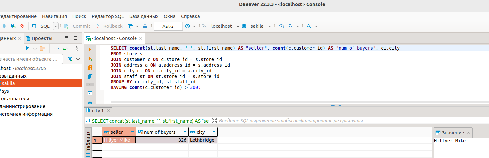
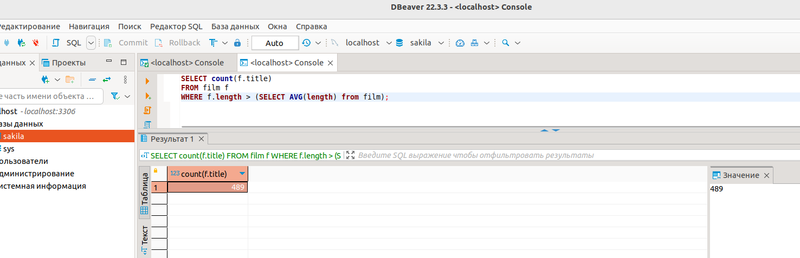

# Домашнее задание к занятию "SQL. Часть 2" - `Нагорнов Антон Алексеевич`

### Задание 1

SELECT concat(st.last_name, ' ', st.first_name) AS "seller", count(c.customer_id) AS "num of buyers", ci.city  
FROM store s  
JOIN customer c ON c.store_id = s.store_id  
JOIN address a ON a.address_id = s.address_id  
JOIN city ci ON ci.city_id = a.city_id  
JOIN staff st ON st.store_id = s.store_id  
GROUP BY ci.city_id, st.staff_id  
HAVING count(c.customer_id) > 300;  

### Задание 2

SELECT count(f.title)  
FROM film f  
WHERE f.length > (SELECT AVG(length) from film);  

### Задание 3

SELECT date_format(payment_date, "%m-%Y"), count(payment_id), sum(amount)  
FROM payment WHERE date_format(payment_date, "%m") GROUP BY date_format(payment_date, "%m-%Y")  
ORDER BY sum(amount) DESC  
LIMIT 1;  

